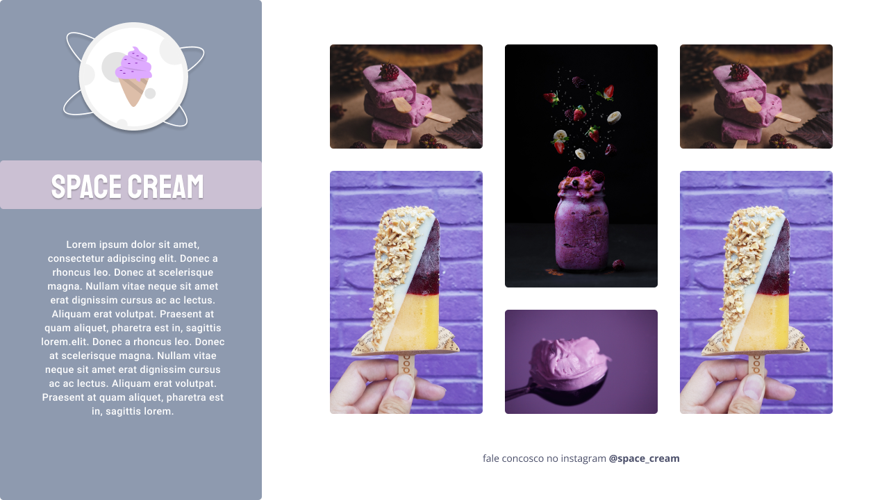

<div align="center">
  
  <h2 align="center">Space Cream</h2>

</div>

<br/>

### Demo Screeshots



### About

Project developed during stage 3 - Moving forward in HTML and CSS, in [Rocketseat](https://github.com/Rocketseat) explorer course.  

Learned concepts:

- CSS animation

- CSS Grid

- CSS variables

- CSS colors

- Form

- Mobile first rule

- Responsiveness

In level 3 we delve into advanced css concepts

### Prerequisites

Before you begin, ensure you have met the following requirements:

- [Git](https://git-scm.com/downloads "Download Git") must be installed on your operating system.

### Run Locally

To run **Space Cream** locally, run this command on your git bash:

Linux and macOS:

```bash
sudo git clone https://github.com/denilsonbaptista/space-cream.git
```

Windows:

```bash
git clone https://github.com/denilsonbaptista/space-cream.git
```

### Contact

If you want to contact with me you can reach me at [Linkedin](https://www.linkedin.com/in/denilsonbaptista/).

### License

This project is **free to use** and does not contains any license.